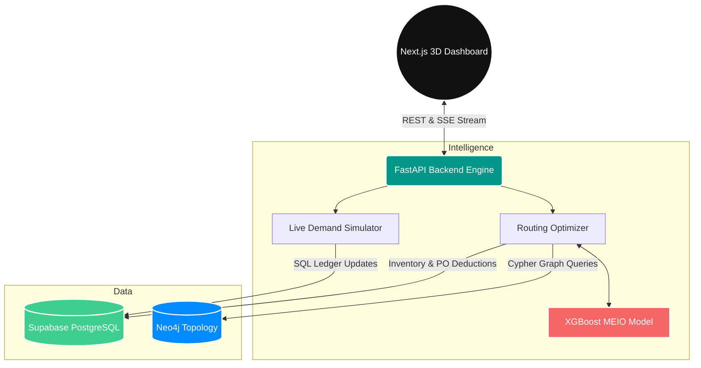
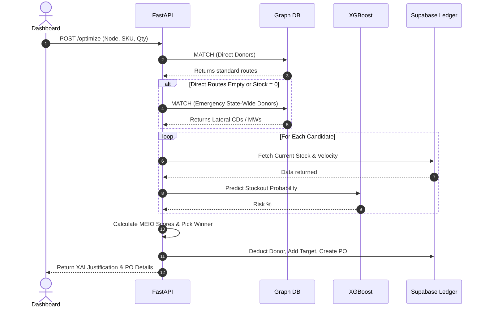
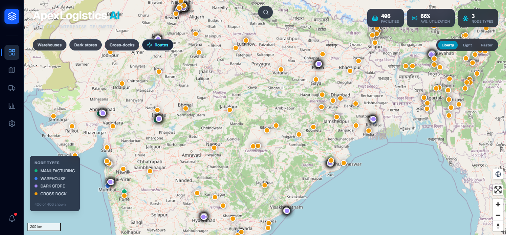
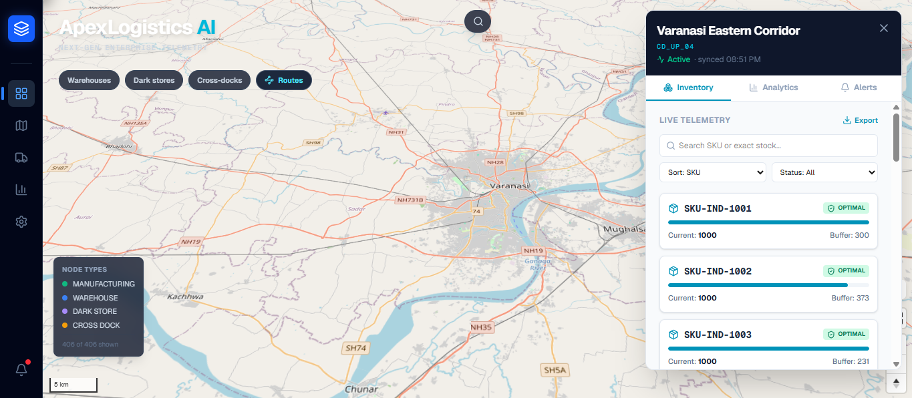
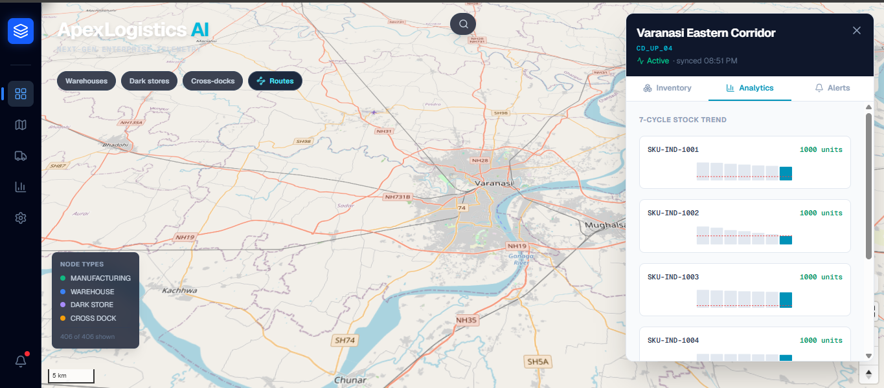
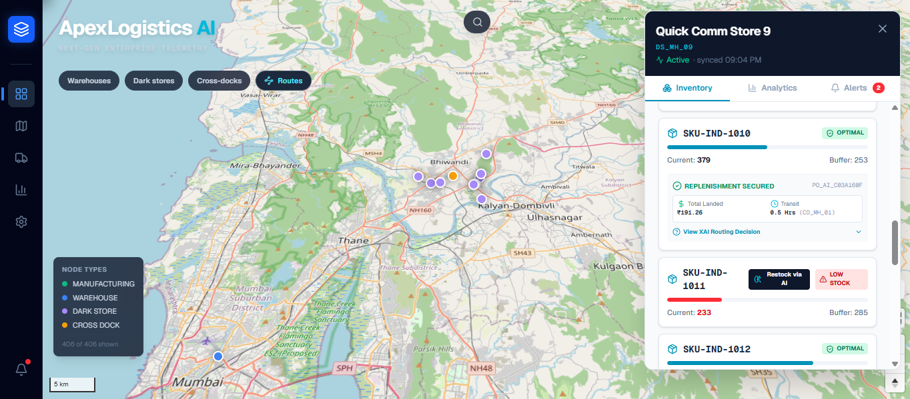

# 📦 ApexLogistics AI

### *Next-Generation Predictive Supply Chain & MEIO Orchestrator*

<div align="center">

*Intelligent Routing, 3D Telemetry, and Autonomous Quick Commerce Replenishment*

<br/>

[](https://apexlogistics-ai.vercel.app/)


</div>

---

# 📌 Overview

**ApexLogistics AI** is an enterprise-grade digital twin and operational orchestrator designed for the modern Indian retail and Quick Commerce landscape. 

It bridges the gap between predictive machine learning and physical logistics, transforming static supply chains into dynamic, demand-driven networks.

Rather than relying on reactive human monitoring, ApexLogistics AI acts as an **Autonomous Network Manager** capable of:
* Live Pan-India supply chain visualization (WebGL 3D)
* Predicting stockout risks via Machine Learning
* Calculating Multi-Echelon Inventory Optimization (MEIO) scores
* Executing automated lateral & vertical transshipments via Graph logic
* Simulating hyper-local Quick Commerce drain and mass production cycles

The platform operates on a robust architecture merging **FastAPI**, **Neo4j Graph Traversals**, **Supabase PostgreSQL**, and **Next.js** into a unified telemetry dashboard.

---

# ✨ What Makes This System Different

Most legacy supply chain dashboards fail at scale because of:
* Flat, non-relational mapping (unable to understand hierarchical topology)
* Reactive alerting (telling you *after* a stockout occurs)
* Siloed data (inventory decoupled from transit risk)
* Inability to evaluate lateral (Cross-Dock to Cross-Dock) emergency routing

ApexLogistics AI was engineered specifically to solve these bottlenecks.

### Core Innovations

✅ **XGBoost Risk Profiler:** Machine learning model predicting stockout probability based on sales velocity and inbound PO volume. <br/>
✅ **Graph-Powered MEIO Routing:** Neo4j dynamically scans for the optimal replenishment route balancing freight cost, transit time, and donor risk. <br/>
✅ **Cinematic Simulation Engine:** Server-Sent Events (SSE) push live JSON payloads to the client, driving real-time 3D truck animations and floating metrics without DOM lag. <br/>
✅ **State-Wide Emergency Fallback:** Intelligent Cypher queries automatically bypass broken hierarchical lines to source emergency inventory from neighboring facilities. <br/>
✅ **Enterprise Presentation Mode:** A hidden, interactive simulation mode focused on the West Bengal / Jharkhand corridor for high-impact stakeholder demonstrations.

---

# 🏗️ High-Level Architecture



---

# 🧠 AI Routing Engine (MEIO)

When a node (like a Dark Store or Cross Dock) triggers a low-stock alert, the AI engine takes over to find the mathematically optimal replenishment path.

### The Algorithm

1. **Topology Scan:** Neo4j scans all connected nodes (Vertical Mother Warehouses and Lateral Cross-Docks). If direct links are out of stock, it expands to a state-wide emergency scan.
2. **Risk Assessment:** For every potential donor, the `xgboost_stockout_model.pkl` calculates the probability of the donor suffering a stockout if it approves the transfer.
3. **MEIO Scoring:** The system calculates a final score to minimize supply chain disruption:
`MEIO = (Freight Cost × 1.0) + (Transit Hours × 500) + (XGBoost Risk % × 25,000)`
4. **Execution:** The system selects the lowest MEIO score, generates a PO, and updates the financial and inventory ledgers via Supabase in milliseconds.

### The Fallback Sequence



---

# 🎬 Cinematic Simulation & Telemetry

ApexLogistics AI includes a custom-built, pull-based demand simulator specifically designed to test the Quick Commerce dynamics of modern retail.

### How It Works

* **The Trigger:** A hidden "Enterprise Presentation Mode" initiates an `asyncio` loop in the backend.
* **The Drain:** The simulation aggressively drains inventory from edge nodes (Dark Stores in Kolkata).
* **The Stream:** The backend broadcasts these events via Server-Sent Events (SSE).
* **The Visualization:** MapLibre GL intercepts the SSE stream, tilting the camera to 60° 3D, turning routes neon cyan, and spawning WebGL trucks that travel precisely along the Neo4j graph lines while floating data metrics erupt into the sky.

---

# 🗄️ Database Architecture

The system utilizes a dual-database architecture, keeping topology relationships strictly separated from transactional ledgers.

### 1. Supabase (PostgreSQL) - Transactional State

| Table | Purpose |
| --- | --- |
| `inventory_ledger` | Real-time SKU stock, buffer limits, velocity |
| `purchase_orders` | Orchestrated AI replenishment tracking |
| `financial_ledger` | Freight costs and emergency premium tracking |

### 2. Neo4j - Graph Topology

| Nodes & Relationships | Purpose |
| --- | --- |
| `(Facility)` | Represents Plants, MWs, CDs, and Dark Stores |
| `[:CAN_TRANSFER_TO]` | Lateral routes enabling emergency transshipment |
| `[:FULFILLS]` | Vertical routes from Cross-Dock to Dark Store |

---

# 📸 Product Walkthrough & Screenshots

## 1️⃣ Pan-India Macro View

The default dashboard displaying **300+ nodes**, network links, and real-time average capacity utilization.

<p align="center">
  
</p>

---

## 2️⃣ Node Drill-Down & Telemetry

Clicking a node reveals **live SKU inventory**, safety buffers, **7-cycle trend analytics**, and active low-stock alerts.

<p align="center">
  
</p>

---

## 3️⃣ Trend Analytics

Historical inventory trends used for monitoring demand and replenishment performance.

<p align="center">
  
</p>

---

## 4️⃣ AI Routing & Explainable AI

An autonomous restock recommendation showing generated purchase orders, landed cost optimization, and a transparent explanation of why a particular donor location was selected.

<p align="center">
  
</p>

---

# ⚙️ Tech Stack

| Layer | Technologies |
| --- | --- |
| **Frontend Framework** | Next.js, React, Zustand |
| **Mapping Engine** | MapLibre GL JS, CARTO Dark Matter |
| **UI & Styling** | Tailwind CSS, Lucide Icons |
| **Backend Engine** | FastAPI, Python, Uvicorn, asyncio (SSE) |
| **Machine Learning** | XGBoost, Scikit-Learn, Pandas |
| **Relational DB** | Supabase PostgreSQL |
| **Graph DB** | Neo4j AuraDB |
| **Deployment** | Vercel (Frontend), Render (Backend) |

---

# 🚀 Deployment Guide

## 1️⃣ Configure Environment Variables

Create a `.env` file in your `backend/` directory:

```env
SUPABASE_URL=your_supabase_url
SUPABASE_KEY=your_supabase_service_role_key

NEO4J_URI=neo4j+s://your_instance.databases.neo4j.io
NEO4J_USERNAME=neo4j
NEO4J_PASSWORD=your_password

```

Create a `.env.local` file in your `frontend/` directory:

```env
NEXT_PUBLIC_API_BASE_URL=[https://your-backend-url.onrender.com](https://your-backend-url.onrender.com)

```

## 2️⃣ Data Engine Initialization

Run the local data engine scripts to build your graph and train the model:

1. `python data_engine/generate_synthetic_db.py` (Builds Neo4j topology and Supabase ledgers)
2. `python data_engine/generate_ml_training_data.py` (Simulates historical stockouts)
3. `python data_engine/train_model.py` (Trains and exports the XGBoost `.pkl` model)

## 3️⃣ Deployment (Monorepo)

* **Backend:** Deploy as a Web Service on Render. Set Root Directory to `backend`. Start Command: `uvicorn app.main:app --host 0.0.0.0 --port $PORT`.
* **Frontend:** Deploy as a Next.js project on Vercel. Set Root Directory to `frontend`.

---

# 📈 Future Roadmap

* [ ] Drone delivery micro-routing simulation
* [ ] Multi-tenant supplier integration
* [ ] Reinforcement Learning integration for dynamic safety buffer adjustments
* [ ] Weather API integration to dynamically alter transit hour calculations
* [ ] WebSocket integration for bi-directional map controls

---

# 👨‍💻 Author

## Shubham Sharma

*MBA — Business Analytics*

Building intelligent systems at the intersection of:

* Supply Chain Analytics
* Predictive Machine Learning
* Quick Commerce Operations
* Enterprise Software Architecture
* Data Visualization

---

### ⭐ If you found this project interesting, consider starring the repository.